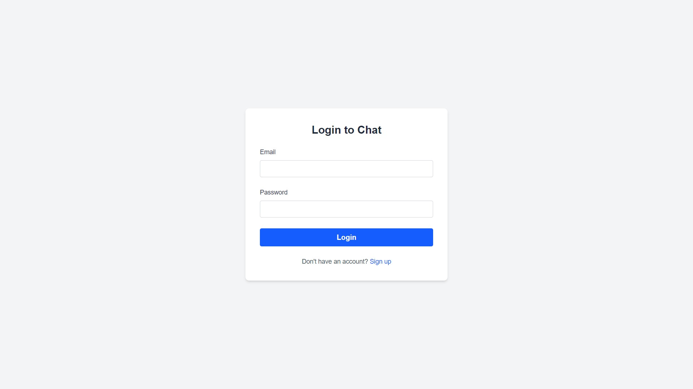
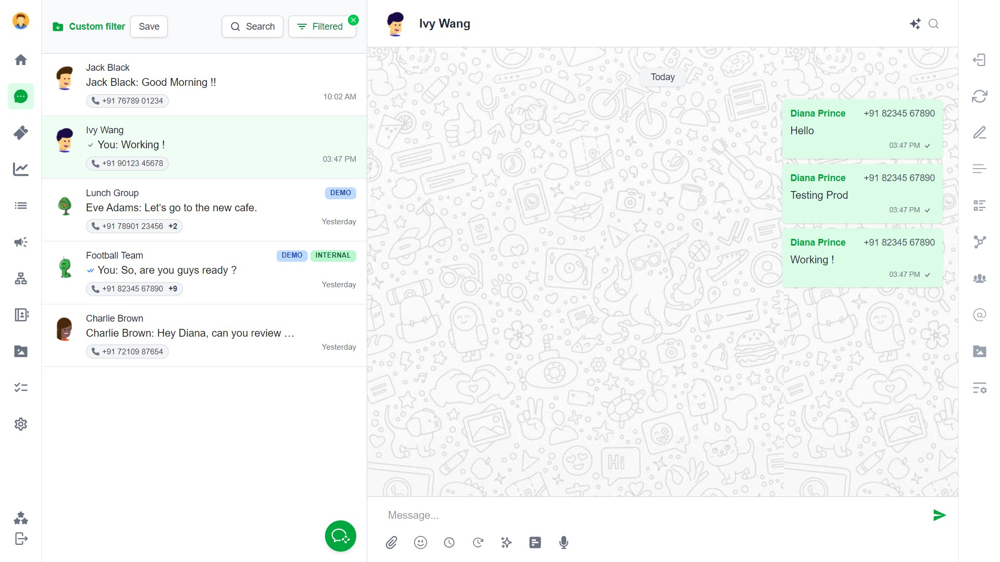
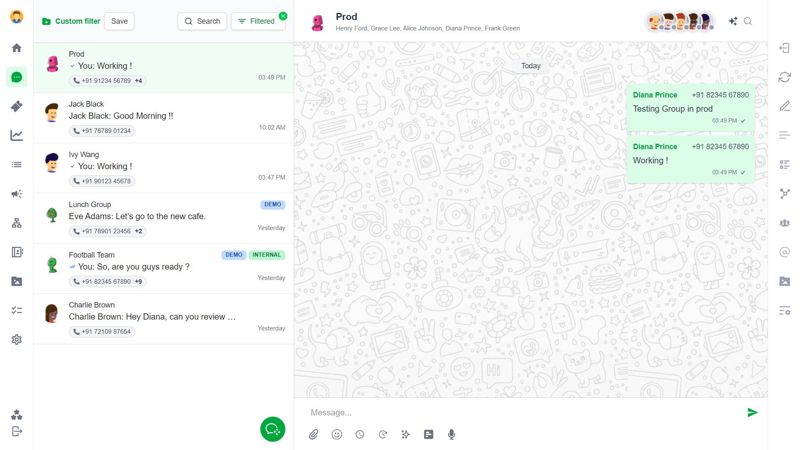
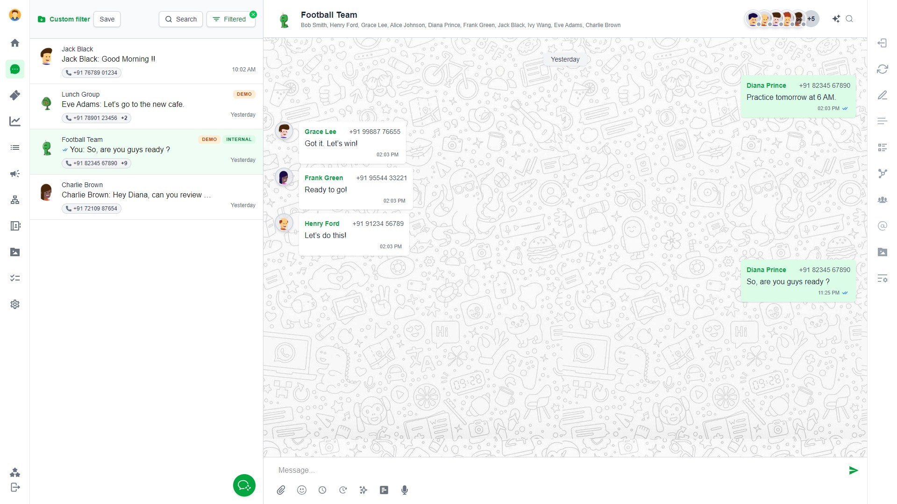

# 💬 Chat App

A fully functional real-time chat application built with **Next.js**, **Supabase**, **Tailwind CSS**, and **TypeScript**. This app supports both one-on-one and group messaging with real-time updates and a sleek user interface.

---

🌐 [Open the Chat App](https://periskope-bay.vercel.app/)

## 📸 Screenshots

| Login Page                        | One-on-One Chat                          | Group Chat                             | Chat Page                          |
| --------------------------------- | ---------------------------------------- | -------------------------------------- | ---------------------------------- |
|  |  |  |  |

---

## 🚀 Features

### 🔐 Authentication

-   Login using Supabase Auth.
-   Unauthenticated users are redirected to the login page.

### 🧑‍🤝‍🧑 Chat Types

-   **One-on-one chats** with individual users.
-   **Group chats** with multiple participants.
-   Group avatar and name support.

### 💬 Real-Time Messaging

-   Real-time message updates using Supabase's Realtime API.
-   Typing a message and pressing send updates both sender and receiver chats instantly.
-   Messages are saved to Supabase and displayed in real time.

### 🖼️ UI and UX

-   Pixel-perfect design, fully replicating the provided mockup.
-   Responsive layout for mobile and desktop.
-   Sidebar includes:
    -   User/group name
    -   Last message preview
    -   Avatar
    -   Timestamp formatted as "Today", "Yesterday", or date
-   Floating "+" button to create a new chat or group.

### 🧠 Chat Creation

-   Modal to:
    -   Start a one-on-one chat by selecting one user.
    -   Create a group chat with group name, avatar, and multiple users.
-   Newly created chat is automatically opened.

### ✅ Message Grouping & Status

-   Messages grouped by date.
-   Message status indicators:
    -   ✔ Sent
    -   ✔✔ Seen

### ✍️ Typing Indicator

-   Shows a real-time "User is typing..." indicator when participants are typing.

---

## 🧱 Supabase Database Schema

### Tables:

-   **users**: stores user info (id, name, avatar_url, phone).
-   **chats**: stores chat data (id, is_group, group name, avatar).
-   **participants**: connects users and chats.
-   **messages**: stores individual messages (content, sender, timestamp, status).

### Features:

-   Real-time updates via Supabase Realtime.
-   Row Level Security (RLS) policies to ensure secure access control.

---

## 🛠️ Tech Stack

| Layer    | Technology                                               |
| -------- | -------------------------------------------------------- |
| Frontend | Next.js 15 (App Router), Tailwind CSS, TypeScript        |
| Backend  | Supabase (PostgreSQL, Auth, Realtime)                    |
| Auth     | Supabase Auth                                            |
| Icons    | [React Icons](https://react-icons.github.io/react-icons) |
| Styling  | Tailwind CSS                                             |

---

## 📂 Folder Structure

src/
├── app/ # Route-based components (e.g., login, chats)
├── components/ # UI components like Sidebar, Main, MessageBubble, Modal
├── lib/ # Supabase client and helper functions
├── styles/ # Global styles

---

## 🧪 Running Locally

1. Clone the repository:

````bash
git clone https://github.com/Rishabh-792/Periskope.git
cd Periskope
npm install

2. Install dependencies:
 ```bash
npm install

3. Create a .env.local file and add your Supabase credentials:
 ```bash
NEXT_PUBLIC_SUPABASE_URL=your-project-url
NEXT_PUBLIC_SUPABASE_ANON_KEY=your-anon-key


4. Run the development server:
```bash
npm run dev


## 🧪 Deployment
🌐 [Open the Chat App](https://periskope-bay.vercel.app/login)


````
